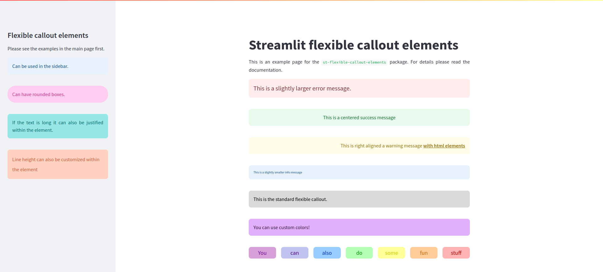
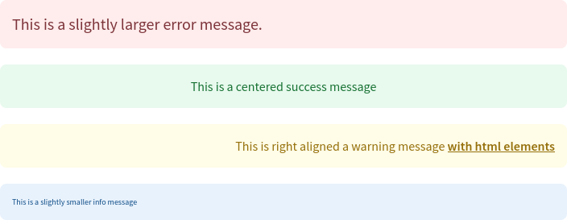
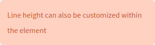
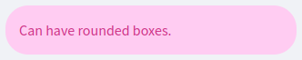
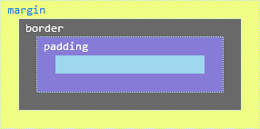

# st-flexible-callout-elements


[Live Demo](https://flexible-callout-elements.streamlit.app)

## About
A package for flexible, customizable callout status elements in Streamlit.

## Installation
```bash
pip install st-flexible-callout-elements
```

## Usage
`flexible_callout()` is the main function of the package and can handle several arguments responsible for customization.

```python
from st_flexible_callout_elements import flexible_callout

flexible_callout(message, container=st, background_color="#D9D9D9", font_color="#000000", font_size=16, alignment="left", line_height=1.5, border_radius=8, padding=15, margin_bottom=20)

Arguments:
- message (str): The message to display.
- container: The Streamlit container to render the message in (default is st).
- background_color (str): The background color of the message box.
- font_color (str): The font color of the message text.
- font_size (int): The font size of the message text in pixels.
- alignment (str): The text alignment inside the message box ("left", "center", "right", "justify").
- line_height (float): The line height of the message text.
- border_radius (int): The border radius of the message box.
- padding (int): The padding inside the message box in pixels.
- margin_bottom (int): The margin below the message box in pixels.
```

Calling the function with just a message and no other arguments, e.g.:

``` python
flexible_callout("This is the standard flexible callout.")
```

Will result in:

<p align="center" width="100%">
   
  </p>

The package contains four other functions `flexible_error()`, `flexible_success()`, `flexible_warning()`, and `flexible_info()` emulating the style of `st.error`, `st.success`, `st.warning`, and `st.info`, respectively. They have most of the same arguments as `flexible_callout()` with the exception of `background_color` and `font_color` which are fixed to match their counterparts.

``` python
from st_flexible_callout_elements import flexible_error, flexible_success, flexible_warning, flexible_info

flexible_error("This is a slightly larger error message.", font_size=20)

flexible_success("This is a centered success message", alignment="center")

flexible_warning("This is right aligned a warning message <b><u>with html elements</b></u>", alignment="right")

flexible_info("This is a slightly smaller info message", font_size=10)
```

<p align="center" width="100%">
   
  </p>

### Customization

#### Container

The `container` argument will define the where your callout element will be displayed. The default is the main container (by using `st`). It can be altered to move the element to the sidebar:

```python
from st_flexible_callout_elements import flexible_info

flexible_info("Can be used in the sidebar.", container=st.sidebar)
```

You can also specify other containers such as specific columns:

```python
from st_flexible_callout_elements import flexible_info

col1, col2 = st.columns(2)

flexible_info("Can be used in a column of choice.", container=col2)
```
**Note:** These arguments are **not text elements**, it should directly reference the container!

#### Background and font color.
The box background and font colors can be customized with `background_color` and `font_color` respectively. Accepted values include HEX color codes and [HTML color names](https://www.w3schools.com/tags/ref_colornames.asp).

```python
from st_flexible_callout_elements import flexible_callout

flexible_callout("You can use custom colors!", background_color="#E0B0FF", font_color="#301934")
```

<p align="center" width="100%">
   
  </p>

#### Font size and alignment
As seen previously, font size (in px) can be changed with the argument `font_size`. Text alignment inside the box can be changed with `alignment`, its options are `left` (default), `center`, `right`, and  `justify`.

#### Line height

Line spacing can be changed with the `line_height` argument.

```python
from st_flexible_callout_elements import flexible_callout

flexible_callout("Line height can also be customized within the element", container=st.sidebar, background_color="#FFD1C1", font_color="#CC5733", line_height=2)
```

<p align="center" width="100%">
   
  </p>

#### Border radius, padding, margin-bottom

The borders of the box can be made rounder or less round by adjusting `border_radius` (default is 8).

```python
from st_flexible_callout_elements import flexible_callout

flexible_callout("Can have rounded boxes.", container=st.sidebar, background_color="#FFCCF2", font_color="#CC3385", border_radius=25)
```

<p align="center" width="100%">
   
  </p>

The distinction between padding and margin can be see in the box element model below:

<p align="center" width="100%">
   
  </p>

The distance between the content and the border can be changed using the `padding` parameter (default is 15):

```python
from st_flexible_callout_elements import flexible_callout

flexible_callout("The boxes can be slimmer", padding=5)
```

The distance between the box and the next element can be customized using the `margin_bottom` argument (default value is 20):

```python
from st_flexible_callout_elements import flexible_callout

flexible_callout("The boxes can be slimmer", margin_bottom=30)
```

#### Integration with other streamlit elements

The flexible callout elements can be integrated with other streamlit functions:

```python
from st_flexible_callout_elements import flexible_callout

@st.fragment
def display_rainbow_text():
    colors = [
        {"text": "You", "bg_color": "#D8A0D8", "font_color": "#6A0D91"},
        {"text": "can", "bg_color": "#C2C2F0", "font_color": "#4B0082"},
        {"text": "also", "bg_color": "#99CCFF", "font_color": "#0033CC"},
        {"text": "do", "bg_color": "#B3FFB3", "font_color": "#009900"},
        {"text": "some", "bg_color": "#FFFF99", "font_color": "#CCCC00"},
        {"text": "fun", "bg_color": "#FFCC99", "font_color": "#CC6600"},
        {"text": "stuff", "bg_color": "#FFB3B3", "font_color": "#B30000"}
    ]

    with st.container():
        cols = st.columns(len(colors))
        for col, color in zip(cols, colors):
            with col:
                flexible_callout(
                    color["text"],
                    background_color=color["bg_color"],
                    font_color=color["font_color"],
                    font_size=18,
                    alignment="center",
                    padding=5
                )
            sleep(0.5)

display_rainbow_text()
```

<p align="center" width="100%">
   
  </p>

